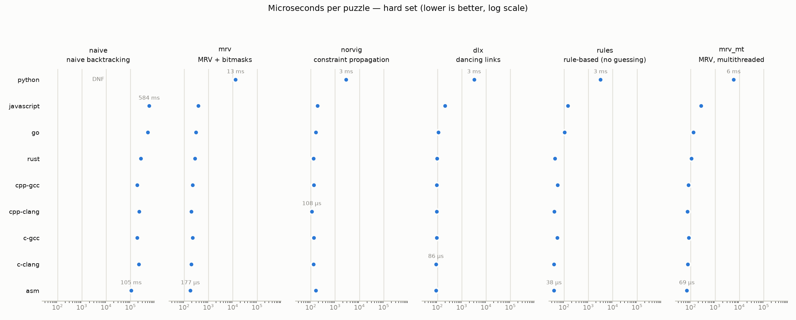
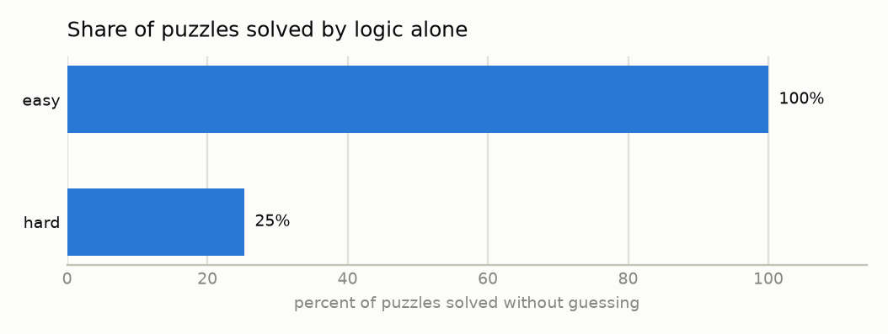
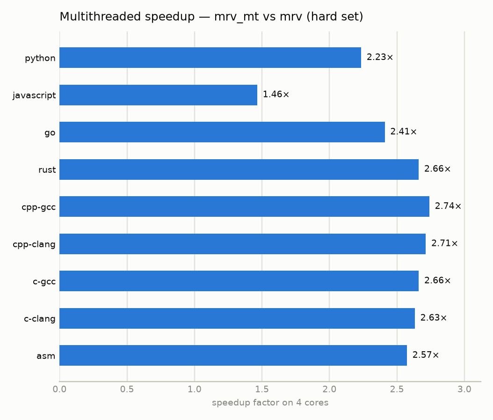

# sudoku

Benchmark of sudoku solving algorithms — naive backtracking, MRV bitmask,
Norvig constraint propagation, Dancing Links (DLX), a pure rule-based solver
and a multithreaded variant — across Python, JavaScript, Go, Rust, C++, C and
x86-64 assembly.

Six algorithms, seven languages, one contract. See [algorithms.md](algorithms.md)
for what each algorithm actually does.

## The contract

Every solver is a standalone program, and that is the whole interface:

```
solver [reps] [threads] < puzzles.txt
```

- **stdin**: one puzzle per line, 81 characters `0`-`9` (`0` = empty)
- **stdout**: one line per puzzle — the 81-digit solution, or `UNSOLVED`
- **stderr**: one line `ns=<nanoseconds>`, covering the solve loop only

Puzzles are read and parsed before the clock starts, so interpreter startup and
I/O stay out of the measurement. `reps` repeats the solve loop — the harness
calibrates it so every measured loop runs at least a second, which is what makes
a 3 µs solver and a 3 s solver comparable on the same axis.

## Running it

```
python3 bench/run.py                 # build, verify, benchmark, regenerate this README
python3 bench/run.py --verify        # correctness only
python3 bench/run.py --lang rust --algo mrv --set hard
tools/crosscheck.sh                  # every implementation vs. reference solutions, all 207 puzzles
```

Implementations that fail verification are excluded from the benchmark rather
than silently reported — a fast wrong answer is not a result.

## Correctness

Two gates, and both must hold before any timing is published. Every solver is
checked against known-unique reference solutions; and because `rules` never
guesses, its output is fully determined by its technique set, so all seven
languages must leave *exactly* the same puzzles unsolved. They do — byte for
byte.

<!-- BENCH:BEGIN -->

Measured on AMD EPYC 7763 64-Core Processor (4 cores), 2026-08-09 21:21:35. Each number is microseconds per puzzle. The repetition count is calibrated so every measured loop runs at least a second, and the median of three runs is reported — except for solvers already taking over five seconds per pass, which are measured once. Lower is better; DNF means the 60 s budget for that set ran out.

<picture>
  <source media="(prefers-color-scheme: dark)" srcset="assets/time_by_impl_dark.png">
  
</picture>

<details><summary>easy set (µs per puzzle)</summary>

| language | naive | mrv | norvig | dlx | rules | mrv_mt |
|---|---|---|---|---|---|---|
| `python` | 38,453.61 | 327.91 | 789.87 | 531.78 | 1,518.64 | 219.60 |
| `javascript` | 3,439.67 | 10.74 | 58.02 | 29.83 | 67.18 | 94.02 |
| `go` | 2,932.51 | 7.48 | 50.52 | 15.15 | 47.20 | 4.02 |
| `rust` | 1,583.05 | 6.95 | 36.81 | 11.79 | 26.18 | 2.56 |
| `cpp-gcc` | 1,179.81 | 5.04 | 38.38 | 11.18 | 26.73 | 1.76 |
| `cpp-clang` | 1,380.70 | 4.80 | **29.35** | 11.19 | 20.28 | 1.76 |
| `c-gcc` | 1,163.17 | 5.32 | 37.45 | 11.24 | 25.73 | 1.94 |
| `c-clang` | 1,359.94 | 4.95 | 36.17 | **10.51** | **20.12** | 1.79 |
| `asm` | **642.78** | **4.38** | 48.04 | 10.87 | 21.71 | **1.63** |

`rules` solved all 50 puzzles of this set by logic alone.

</details>

<details><summary>medium set (µs per puzzle)</summary>

| language | naive | mrv | norvig | dlx | rules | mrv_mt |
|---|---|---|---|---|---|---|
| `python` | 38,291.09 | 329.13 | 788.47 | 535.73 | 1,513.65 | 211.70 |
| `javascript` | 3,438.40 | 10.75 | 57.89 | 29.74 | 66.96 | 91.94 |
| `go` | 2,931.76 | 7.48 | 50.72 | 14.82 | 47.05 | 4.01 |
| `rust` | 1,583.89 | 6.89 | 36.83 | 11.78 | 26.19 | 2.55 |
| `cpp-gcc` | 1,179.98 | 5.02 | 38.40 | 11.16 | 26.74 | 1.76 |
| `cpp-clang` | 1,380.44 | 4.81 | **29.41** | 11.02 | 20.26 | 1.77 |
| `c-gcc` | 1,163.35 | 5.32 | 37.49 | 11.04 | 25.73 | 1.94 |
| `c-clang` | 1,359.72 | 4.99 | 36.20 | **10.61** | **20.15** | 1.79 |
| `asm` | **643.07** | **4.39** | 48.04 | 10.88 | 21.71 | **1.63** |

`rules` solved all 50 puzzles of this set by logic alone.

</details>

### hard set (µs per puzzle)

| language | naive | mrv | norvig | dlx | rules | mrv_mt |
|---|---|---|---|---|---|---|
| `python` | DNF | 12,869.01 | 2,797.13 | 3,166.14 | 3,122.36 | 5,758.79 |
| `javascript` | 583,880.74 | 381.60 | 186.93 | 199.93 | 143.19 | 260.57 |
| `go` | 504,209.88 | 303.21 | 159.62 | 106.83 | 102.16 | 125.83 |
| `rust` | 260,176.02 | 277.38 | 127.99 | 95.87 | 42.00 | 104.23 |
| `cpp-gcc` | 188,730.47 | 217.32 | 132.08 | 90.74 | 52.64 | 79.31 |
| `cpp-clang` | 223,259.50 | 195.85 | **108.32** | 91.71 | 38.59 | 72.17 |
| `c-gcc` | 186,472.38 | 220.12 | 129.81 | 92.12 | 51.49 | 82.70 |
| `c-clang` | 216,662.77 | 193.44 | 127.41 | **85.63** | 37.97 | 73.49 |
| `asm` | **104,868.56** | **176.75** | 161.35 | 86.82 | **37.83** | **68.67** |

`rules` solved 24 of 95 puzzles here and gave up on the rest, so its column covers less work than the others — it is not faster, it is doing less.

<details><summary>extreme set (µs per puzzle)</summary>

| language | naive | mrv | norvig | dlx | rules | mrv_mt |
|---|---|---|---|---|---|---|
| `python` | DNF | 1,204.38 | 1,022.26 | 975.53 | 2,434.31 | 954.40 |
| `javascript` | 831,306.08 | 36.81 | 75.33 | 63.16 | 121.32 | 350.44 |
| `go` | 711,021.14 | 25.29 | 63.50 | 29.48 | 78.15 | 19.95 |
| `rust` | 356,998.30 | 23.10 | 45.10 | 25.18 | 32.34 | 8.78 |
| `cpp-gcc` | 254,597.20 | 16.09 | 47.00 | 23.36 | 37.33 | 6.00 |
| `cpp-clang` | 305,133.44 | 15.95 | **36.26** | 23.96 | 24.58 | 5.92 |
| `c-gcc` | 251,189.19 | 17.74 | 45.76 | 23.97 | 35.52 | 6.78 |
| `c-clang` | 299,882.00 | 15.41 | 44.29 | **22.29** | **24.58** | 6.03 |
| `asm` | **137,915.46** | **14.31** | 60.30 | 23.22 | 28.51 | **5.51** |

`rules` solved 5 of 12 puzzles here and gave up on the rest, so its column covers less work than the others — it is not faster, it is doing less.

</details>

### How far pure logic gets you

The `rules` solver never guesses. Whatever it leaves `UNSOLVED` genuinely needs search:

<picture>
  <source media="(prefers-color-scheme: dark)" srcset="assets/rules_solve_rate_dark.png">
  
</picture>

### Multithreading

<picture>
  <source media="(prefers-color-scheme: dark)" srcset="assets/mt_speedup_dark.png">
  
</picture>

### How the algorithms scale with difficulty

Time per puzzle in `cpp-gcc`, and how much of it the hard set costs:

| algorithm | easy | hard | factor |
|---|---|---|---|
| `naive` | 1,179.8 | 188,730.5 | 160.0× |
| `mrv_mt` | 1.8 | 79.3 | 45.1× |
| `mrv` | 5.0 | 217.3 | 43.2× |
| `dlx` | 11.2 | 90.7 | 8.1× |
| `norvig` | 38.4 | 132.1 | 3.4× |

The ranking is not a property of the algorithms — it is a function of how hard the input is. Constraint propagation carries a high fixed cost per assignment and spends it whether or not there is a search tree to prune, which makes it the slowest choice on easy puzzles and a good one where the search actually explodes. Plain MRV is the opposite: almost free per cell, but it pays the full price of every branch it has to take.

Note also that `extreme` here is not the hardest set for a machine. Those puzzles are hard for *humans*; their search trees are shallow, so the solvers that win on `hard` do not win on `extreme`.

<!-- BENCH:END -->
